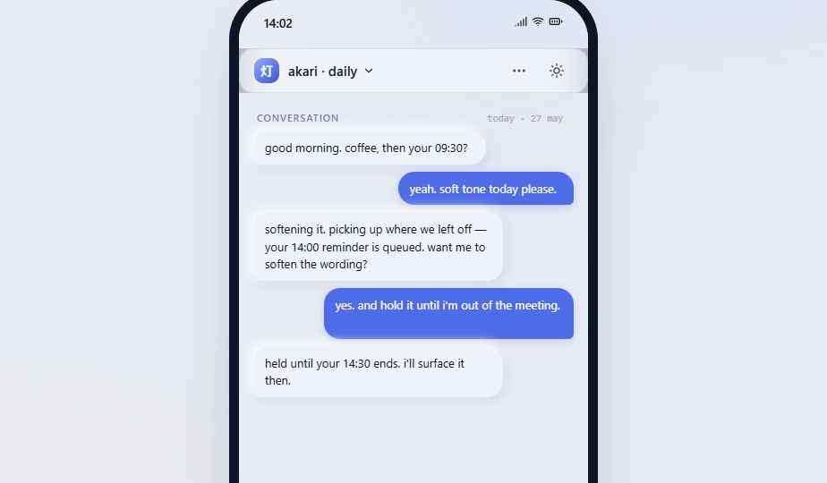
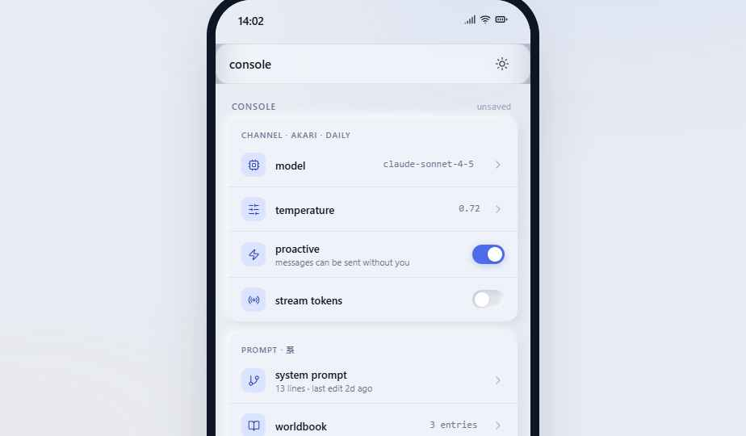

# yoru-and-akari Console Design System

> 夜と灯 — **a personal control console for an AI companion.**
> The dark and the lamp on it. The dark holds the room; the lamp gives you somewhere to be.

This design system describes a **mobile-first, daily-driver console** for configuring an AI companion: channels, memory, prompts, worldbook, timeline, logs, model providers, proactive messages, tools, and safety controls. It is *not* a generic SaaS dashboard. It should feel like a real device the user opens many times a day — tactile, calm, dense without being noisy.




---

## Sources

This system was authored **from the requirements specification alone** — no codebase, Figma, or prior screenshots were attached. Everything (colors, type, components, voice) is original, designed to satisfy the brief:

- mobile-first, desktop-respectful
- soft neumorphism + subtle liquid glass
- compact typography
- rounded inset controls
- calm blue / near-blue color family
- tunable light/dark — **akari** (灯, light) and **yoru** (夜, dark)
- behaviorally real (enabled/disabled, selected/unselected, collapsed/expanded, saved/unsaved, error/normal)

If you have a real codebase, Figma file, screenshots, or product copy to anchor against, please attach them and I'll re-derive the foundations from the actual source.

---

## Index

```
colors_and_type.css       — all tokens (themes, type scale, spacing, radii, shadows, motion)
README.md                 — this file (foundations, voice, iconography, index)
SKILL.md                  — agent-skill manifest for downstream Claude Code / agent use
preview/                  — Design-System-tab cards (one HTML per concept)
ui_kits/console/          — mobile + desktop UI kit (index.html + JSX components)
uploads/                  — running console instance (index.html + main.css + app.js),
                             imported from Claude Design; the deployed product surface
briefs/                   — active implementation plans (see cc-multi-device-and-ios26.md)
screenshots/              — reference screenshots of the running console
fonts/                    — webfont notes (Geist, Geist Mono, Zen Kaku Gothic New)
assets/                   — brand mark notes, icon set reference
```

> **On `uploads/`.** The name is a Claude Design artifact — this directory is *not* a scratch drop, it is the deployed console instance we ship against. `uploads/colors_and_type.css` is a snapshot taken when that instance was published; the ROOT `colors_and_type.css` is the design-system **source of truth** going forward. The two files currently diverge: root introduces a **frost** accent family and reshapes the **ember** ramp (root uses a pure-orange ember `#F06A20` and adds `--frost-100…700`; the uploads snapshot uses a warmer terra-cotta ember `#D97757` and has no frost tokens), and root carries `@kind other` annotations on the motion tokens. Treat uploads as a frozen mirror — re-snapshot it when the running console is next redeployed, do not edit it in-place.

UI kits:
- **`ui_kits/console/`** — the only product surface in this brief. Mobile-first companion console with chat, timeline, settings, memory, logs, and provider sheets.
- **`uploads/`** — the same console, deployed. See the note above.

---

## Brand concept

Two halves of a day-rhythm, one product:

| | **akari** (灯) | **yoru** (夜) |
|---|---|---|
| theme | light | dark |
| surface | cool porcelain (`#E8ECF3`) | midnight indigo (`#0B1020`) |
| primary | `#4F6CE8` — calm royal blue | `#7A95FA` — lifted indigo |
| ember | `#F06A20` — pure warm orange | `#F07830` — bright amber |
| frost | `#1EA8A0` — cool cyan | `#38C8C0` — vivid teal |
| feel | morning room with the curtain half-open | bedside lamp before sleep |

The mark is a small warm circle (the lamp) tangent to a larger cool circle (the night). Wordmark is lowercase `yoru·akari`. JP subtitle: `夜と灯`.

---

## CONTENT FUNDAMENTALS

**Voice.** Quiet, second-person, present-tense, lowercase by default. The console addresses *you* and refers to the companion by name (`akari`, `yoru`) — not "the assistant," not "the AI." Microcopy is short and confident; settings labels are nouns or noun phrases, not sentences.

**Casing.** All UI labels, button text, menu items, tab labels, and section headings are **lowercase**, including the brand: `yoru·akari`. Sentence case appears only inside user-authored content (system prompts, memory notes, worldbook entries) and inside generated copy that quotes the companion. Title Case is never used. ALL CAPS appears only on eyebrow labels with `letter-spacing: 0.08em`.

**Person.** Always **you** to the operator. The companion speaks in **I**. The system never says "we." Examples:

- ✅ `picking up where we left off`
- ✅ `your 14:00 reminder is queued`
- ✅ `i held three messages until 07:30`
- ❌ `We've queued your reminder.`
- ❌ `The AI Assistant is ready.`

**Pronouns for the companion.** Use the companion's name first (`akari`, `yoru`); use `i` when the companion speaks. Never `it`. Never personality-strip the companion into "the assistant" in UI copy.

**Empty states & moments.** Lean toward a single calm line. No exclamation marks. No "Welcome!" greetings.

- empty channels — `no channels yet. add one to start a daily rhythm.`
- empty memory — `nothing remembered yet. memories will appear here after a few conversations.`
- error toast — `provider returned 429 · retrying in 12s`
- saved toast — `saved · 14:02`

**Numbers & units.** 24-hour time (`14:02`, `02:17`). Tokens with thin separators (`1,284 / 200,000`). Costs to 4dp (`$0.0046`). Latencies in `ms`. Models as their canonical id (`claude-sonnet-4-5`), not marketing names.

**Japanese accents.** Used sparingly — section captions, brand moments, the wordmark subtitle — never inside primary labels. When used, set in `Zen Kaku Gothic New` and pair with a romanized gloss when meaning matters (`記憶 · memory`).

**Emoji.** **No emoji in UI chrome.** No 🌙, no ✨, no 💬. The companion may use them inside generated chat text if the user asks for it, but the console itself never does. Use status dots (colored circles) and Lucide glyphs instead of decorative emoji.

**Tone examples.**
- channel description: `morning + evening check-ins. soft tone. holds messages during quiet hours.`
- safety nudge: `messages outside quiet hours only · 07:30 → 21:00`
- log entry: `412ms · 1.2k tok · $0.0046`
- proactive prompt: `there's something on your calendar in 30 min — want me to remind you closer?`

---

## VISUAL FOUNDATIONS

### Color
Two themes, one vocabulary. Both rotate around a **single calm blue family** — never purple. **Ember** (pure orange) and **frost** (cool cyan) are the two supporting accents, each used at < 5% of any view. Ember supplies warmth (a glowing dot, a charged badge, a lamp glyph); frost supplies coolness (a status indicator, a secondary accent, a calm highlight). Saturation drops as you go darker in `yoru` to keep things eye-friendly at 02:00.

- `bg-base` < `bg-surface` < `bg-elevated` (raised cards, popovers)
- `bg-sunken` for **inputs and any inset control** — this is core to the language
- ink ramps to 4 stops (primary → tertiary → disabled)
- semantic colors come in 100/500/700 pairs and **always pair a tinted bg with a deeper text**

### Type
**Geist** for UI (Google Fonts — substitute, see CAVEATS). **Geist Mono** for logs, model ids, numbers, console output. **Zen Kaku Gothic New** for JP accents. Base size **13px** — compact, console-grade. Display sizes (28–44px) for empty-state headlines and the title row of a settings sheet. Nothing smaller than 11px on screen. Tracking is tight on display (`-0.012em`); body is neutral; eyebrow uses `+0.08em` caps.

### Spacing
4px base. Settings rows hit 44px+ height to stay tappable. Card padding is generous (12–16px) so neumorphic shadows have room to breathe.

### Backgrounds
Surfaces are mostly **flat solid colors** with very subtle **radial color washes** at the page level — a tiny blue glow upper-right, a tiny ember glow lower-left. No hero illustrations. No full-bleed photography. No repeating patterns. No marketing gradients. The visual richness comes from **shadow + glass**, not from imagery.

### Shadows — the core motif
**Soft neumorphism with tinted shadows** (never pure black):

- `--shadow-raised` — gentle two-sided shadow for cards
- `--shadow-lifted` — same shape, more depth, for the currently-focused surface
- `--shadow-inset` — for any **input**, **sunken control**, or **pressed button**
- `--shadow-pop` — only for popovers, sheets, toasts (drop-shadow, single-sided)
- `--shadow-focus` — 3px halo at `--primary-500 / 0.28`, never a 1px outline

`akari` shadows use white highlights (`rgba(255,255,255,0.95)`) and cool slate lows (`rgba(143,158,191,0.45)`). `yoru` shadows use near-white at 5% (`rgba(255,255,255,0.05)`) and deep blacks (`rgba(0,0,0,0.55)`).

### Liquid glass (used sparingly)
The **tab bar, header sheet, and active-state pills** sit on a glass surface: `backdrop-filter: blur(18px) saturate(140%)` over a translucent base (`hsla(220, 30%, 98%, 0.62)` in akari, `hsla(225, 35%, 14%, 0.62)` in yoru) with a 1px tinted hairline. Glass appears *only* where there is content behind it worth showing through. Never over a flat surface for decoration.

### Borders
Hairlines, not "borders." `--line-1` is 6% ink, `--line-2` is 10%. **Cards are defined by shadow**, not by stroke. The only stroked elements are: glass surfaces (1px tinted), focused inputs (3px halo), selected items (1.5px primary), error inputs (2px error). Avoid rounded rectangles with a colored left-border accent stripe — that's not in this vocabulary.

### Radii
6 / 9 / 12 / 16 / 22 / pill. Buttons are `12`. Settings rows are `12` inside a `16` group. Cards are `16` or `18`. Tab bar is `22`. Avatars are pill or `14`-rounded squircles (companions use the latter).

### Hover / press / focus

- **Hover (desktop).** Surfaces lift by ~2px equivalent shadow strength; ghost buttons fill to `--bg-tint`. Never a color change to the text.
- **Press.** Everything goes **inset**. `--shadow-raised` flips to `--shadow-inset` over `--dur-fast`. Buttons get `transform: scale(0.985)`. This applies to icon buttons too.
- **Focus.** Always `--shadow-focus` (a soft 3px primary halo), never a browser outline. Inputs combine inset + focus halo.

### Selected / active
The **selected** state for a list item is: keep the surface flat-recessed (subtle inset), add a **1.5px primary stroke**, and put a small primary indicator. Never a fully tinted background — that competes with the unsaved-changes / error dots.

### Disabled
Drop saturation to ~40% on the surface, lift ink to `--ink-4`, remove shadows entirely. Disabled controls do not have inset shadows.

### Animation
Calm, no bounces by default.

- `--dur-fast 140ms` — toggles, press states, hovers
- `--dur-base 220ms` — toggles knob slide, drawer expand, tab cross-fade
- `--dur-slow 420ms` — sheet enter, focus halo grow
- `--ease-out cubic-bezier(0.22, 1, 0.36, 1)` — entry
- `--ease-spring` — *only* for the proactive "now" indicator and the lamp avatar idle pulse

No fades-from-nothing — content always slides 4-8px or scales from 0.97. Never spin loaders; use a 3-dot typing indicator inside a bubble, or a single 7px primary dot inhaling/exhaling.

### Imagery vibe
Cool, calm, slightly blue. No grain. No warm tones except the ember accent. Avatars are generated from JP characters on a 14-rounded squircle with a soft directional gradient — no photographic avatars, no AI-portrait illustrations.

### Layout rules

- **Mobile-first**, design width **390px**. Desktop is the same canvas at 1280–1440 with the channel list pinned left and a right inspector panel that mirrors the mobile drawer.
- **Bottom tab bar** is the primary nav (4 tabs: chat · timeline · memory · console). It is always **floating glass**, 16px from edges.
- **Top app bar** is compact (44px). Glass surface when there's scrollable content below it; flat when there isn't. Never sticky-shadow-stacked.
- Settings pages **never overlap cards** at the top edge. Use a single scroll container with a glass top fade — no double cards under the app bar.
- **Hit minimum 44×44px** for every tappable target. Settings rows are 48–56px tall.
- Logs are **collapsed by default**. The row shows a small red `error-dot` *only when the log has errors* — otherwise nothing on the right edge except duration + tokens.
- Timeline is a **real rail**, not stacked cards. Day headers group events. Each event is a dot on a vertical line with a small offset content block.

---

## ICONOGRAPHY

**Lucide** (`https://unpkg.com/lucide@0.452.0`) at **18px** with **1.75 stroke** — the default everywhere except the bottom tab bar (which uses 18px / 1.75 as well, just spaced wider). Lucide gives us a thin, calm, consistent set that matches the porcelain/midnight surface vibe better than Heroicons (too geometric) or Phosphor (too playful).

**This is a substitution.** No codebase icons were attached, so I picked the closest CDN-available set. If you have a real icon font / SVG sprite, drop it under `assets/icons/` and I'll swap it in.

**Common bindings (chosen, not invented):**

| concept | icon |
|---|---|
| chat | `message-square-text` |
| timeline | `clock` |
| memory | `brain` |
| worldbook | `book-open` |
| prompt | `git-branch` |
| logs | `terminal` |
| model | `cpu` |
| proactive | `zap` |
| tools | `wrench` |
| safety | `shield` |
| akari (theme) | `sun` |
| yoru (theme) | `moon` |
| quiet hours | `bell-off` |
| console | `settings` |
| provider | `plug` |
| api key | `key` |

**No emoji as icons.** **No unicode glyphs as icons** (no `⌘`, no `↻`, etc.). The only Unicode "glyph" in the visual system is `·` as a wordmark separator and `›` as an inline chevron in settings rows — and even those are being replaced with Lucide `chevron-right` in the v2 UI kit.

**Companion avatars** are *not* icons — they're branded glyphs: a JP character (`灯` `夜` `読`) on a soft gradient squircle. See `preview/avatars.html`.

**Brand mark** is built with pure CSS (radial gradients + box-shadow) — see `preview/brand-mark.html`. No SVG file. If you want one I can export.

---

## Behavior cheatsheet

The components should communicate state, not decoration. A few non-negotiable rules:

- **saved vs unsaved.** A tiny yellow dot (`warning-500`) next to the title is the *only* unsaved indicator. No "Save" button glow. A confirm toast fires on save with `saved · 14:02`.
- **error vs normal.** The error dot appears only when the component owns an error. Errors propagate up: an errored log promotes a small dot onto its row; an errored channel promotes a dot onto its card.
- **collapsed vs expanded.** Logs, settings groups, and worldbook entries are collapsed by default. Chevron rotates 90° on expand. The expanded body is a sunken (inset-shadowed) panel.
- **selected vs unselected.** Use the 1.5px primary stroke + inset shadow, not a tint.
- **enabled vs disabled.** Disabled removes all shadows and drops opacity. Toggles in disabled state are visibly inert (no knob shadow).
- **streaming vs settled.** A streaming message bubble has a 1px hairline that breathes at `--dur-slow`. Settled bubbles have a static shadow.
- **proactive vs reactive.** Proactive messages get an ember dot before the time. Reactive messages get nothing.

---

## CAVEATS — current state

This system is **in production use**: `uploads/` holds the running console instance, and
`briefs/cc-multi-device-and-ios26.md` is the active plan for the responsive / iOS-26 pass
(not yet implemented). Remaining real caveats:

1. **Fonts load from Google Fonts** (Geist + Geist Mono + Zen Kaku Gothic New via the `@import` in `colors_and_type.css`) — offline or on a bad international route they fall back to system faces. Self-hosting is a planned batch.
2. **Icons are Lucide from unpkg CDN** (pinned `0.452.0`) — same network caveat; vendoring locally is planned alongside the fonts.
3. **Brand mark is CSS-only** (radial gradients + box-shadow, see `preview/brand-mark.html`) — intentional; export an SVG only if a non-web surface needs it.
4. **Root `colors_and_type.css` is the source of truth**; the copy inside `uploads/` is a frozen snapshot of the deployed instance (see the note in the directory map above).
